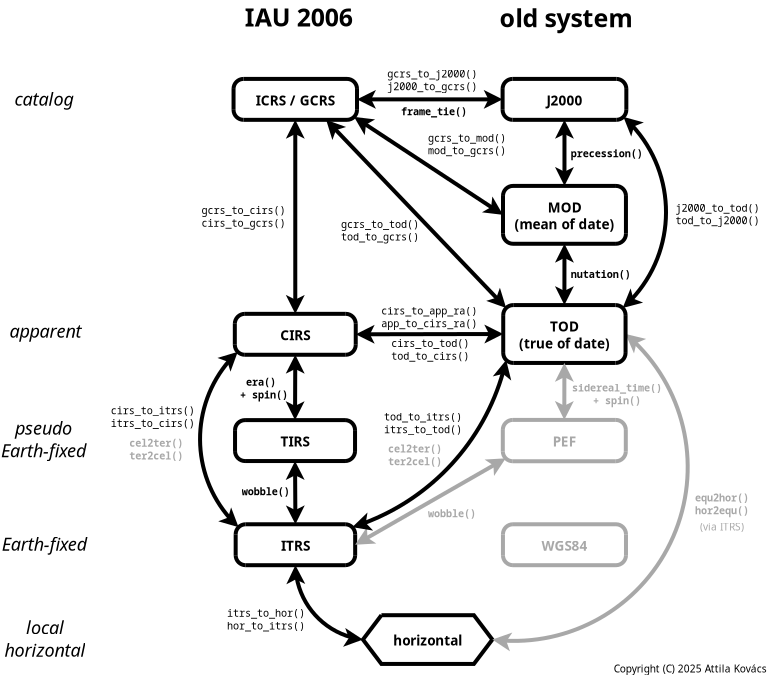
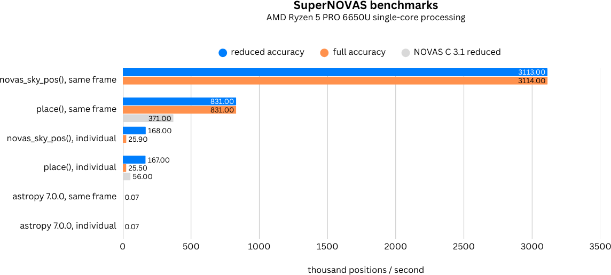

<a href="https://smithsonian.github.io/SuperNOVAS/apidoc/html/files.html">
 
</a>
<a href="https://codecov.io/gh/Smithsonian/SuperNOVAS">
 
</a>

<picture>
  <source srcset="resources/CfA-logo-dark.png" alt="CfA logo" media="(prefers-color-scheme: dark)"/>
  <source srcset="resources/CfA-logo.png" alt="CfA logo" media="(prefers-color-scheme: light)"/>
  
</picture>
<br clear="all">

# SuperNOVAS 

[](https://doi.org/10.5281/zenodo.14584983)

The NOVAS C astrometry library, made better.

 - [API documentation](https://smithsonian.github.io/SuperNOVAS/apidoc/html/files.html)
 - [SuperNOVAS pages](https://smithsonian.github.io/SuperNOVAS) on github.io 

[SuperNOVAS](https://github.com/Smithsonian/SuperNOVAS/) is a C/C++ astronomy software library, providing 
high-precision astrometry such as one might need for running an observatory, a precise planetarium program, or for
analyzing astronomical datasets. It is a fork of the Naval Observatory Vector Astrometry Software 
([NOVAS](https://aa.usno.navy.mil/software/novas_info)) C version 3.1, providing bug fixes, tons of extra features, 
while making it easier (and safer) to use also.

__SuperNOVAS__ is easy to use and it is very fast, providing 3--5 orders of magnitude faster position calculations 
than [astropy](https://www.astropy.org/) 7.0.0 in a single thread (see the [benchmarks](#benchmarks)), and its 
performance will scale with the number of CPUs when calculations are performed in parallel threads.

__SuperNOVAS__ is entirely free to use without licensing restrictions. Its source code is compatible with the C99 
standard, and hence should be suitable for old and new platforms alike. And, despite it being a light-weight library,
it fully supports the IAU 2000/2006 standards for sub-microarcsecond position calculations. 

This document has been updated for the `v1.5` and later releases.


## Table of Contents

 - [Introduction](#introduction)
 - [Fixed NOVAS C 3.1 issues](#fixed-issues)
 - [Compatibility with NOVAS C 3.1](#compatibility)
 - [Building and installation](#installation)
 - [Building your application with SuperNOVAS](#integration)
 - [Celestial coordinate systems (old vs. new)](#methodologies)
 - [Example usage](#examples)
 - [Incorporating Solar-system ephemeris data or services](#solarsystem)
 - [Notes on precision](#precision)
 - [Tips and tricks](#tips)
 - [Runtime debug support](#debug-support)
 - [Representative benchmarks](#benchmarks)
 - [SuperNOVAS added features](#supernovas-features)
 - [Release schedule](#release-schedule)

-----------------------------------------------------------------------------

<a name="introduction"></a>
## Introduction

__SuperNOVAS__ is a fork of the The Naval Observatory Vector Astrometry Software 
([NOVAS](https://aa.usno.navy.mil/software/novas_info)). (It is not related to the separate NOVA / libnova library.)

The primary goal of __SuperNOVAS__ is to improve on the original NOVAS C library via:

 - Fixing [outstanding issues](#fixed-issues).
 - Improved [API documentation](https://smithsonian.github.io/SuperNOVAS/apidoc/html/files.html).
 - [Faster calculations](#benchmarks).
 - [New features](#added-functionality).
 - [Refining the API](#api-changes) to promote best programming practices.
 - [Thread-safe calculations](#multi-threading).
 - [Debug mode](#debug-support) with informative error tracing.
 - [Regression testing](https://codecov.io/gh/Smithsonian/SuperNOVAS) and continuous integration on GitHub.

At the same time, __SuperNOVAS__ aims to be fully backward compatible with the intended functionality of the upstream 
NOVAS C library, such that it can be used as a _build-time_ replacement for NOVAS in your application without having 
to change existing (functional) code you may have written for NOVAS C. 

__SuperNOVAS__ is really quite easy to use. Its new API is just as simple and intuitive as that of __astropy__ (or so 
we strive for it to be), and it is similarly well documented also (see the 
[API documentation](https://smithsonian.github.io/SuperNOVAS/apidoc/html/files.html)). You can typically achieve the 
same results with 
[similar lines of code](https://github.com/Smithsonian/SuperNOVAS/blob/main/resources/supernovas_vs_astropy.md) 
with __SuperNOVAS__ as with __astropy__, notwithstanding a little more involved error handling at every step (due to 
the lack of `try / except` style constructs in C).
 
__SuperNOVAS__ is currently based on NOVAS C version 3.1. We plan to rebase __SuperNOVAS__ to the latest upstream 
release of the NOVAS C library, if new releases become available.
 
__SuperNOVAS__ is maintained by [Attila Kovács](https://github.com/attipaci) at the Center for Astrophysics \| Harvard 
&amp; Smithsonian, and it is available through the [Smithsonian/SuperNOVAS](https://github.com/Smithsonian/SuperNOVAS) 
repository on GitHub.

Outside contributions are very welcome. See
[how you can contribute](https://github.com/Smithsonian/SuperNOVAS/CONTRIBUTING.md) on how you can make __SuperNOVAS__ 
even better.

### Related links

 - [NOVAS](https://aa.usno.navy.mil/software/novas_info) home page at the US Naval Observatory.
 - [CALCEPH C library](https://calceph.imcce.fr/docs/4.0.0/html/c/index.html) for integrating Solar-system ephemerides
   from JPL and/or in INPOP 2.0/3.0 format.
 - [NAIF SPICE toolkit](https://naif.jpl.nasa.gov/naif/toolkit.html) for integrating Solar-system ephemerides
   from JPL.
 - [Smithsonian/cspice-sharedlib](https://github.com/Smithsonian/cspice-sharedlib) for building CSPICE as a shared
   library for dynamic linking.
 - [IAU Minor Planet Center](https://www.minorplanetcenter.net/iau/mpc.html) provides up-to-date orbital elements
   for asteroids, comets, and near-Earth objects (NEOs), including newly discovered objects.


-----------------------------------------------------------------------------

<a name="fixed-issues"></a>
## Fixed NOVAS C 3.1 issues

__SuperNOVAS__ fixes a number of outstanding issues with NOVAS C 3.1:

 - Fixes the [sidereal_time bug](https://aa.usno.navy.mil/software/novas_faq), whereby the `sidereal_time()` function 
   had an incorrect unit cast. This was a documented issue of NOVAS C 3.1.
   
 - Fixes the [ephem_close bug](https://aa.usno.navy.mil/software/novas_faq), whereby `ephem_close()` in 
   `eph_manager.c` did not reset the `EPHFILE` pointer to NULL. This was a documented issue of NOVAS C 3.1.
     
 - Fixes antedating velocities and distances for light travel time in `ephemeris()`. When getting positions and 
   velocities for Solar-system sources, it is important to use the values from the time light originated from the 
   observed body rather than at the time that light arrives to the observer. This correction was done properly for 
   positions, but not for velocities or distances, resulting in incorrect observed radial velocities or apparent 
   distances being reported for spectroscopic observations or for angular-physical size conversions. 
   
 - Fixes bug in `ira_equinox()` which may return the result for the wrong type of equinox (mean vs. true) if the 
   `equinox` argument was changing from 1 to 0, and back to 1 again with the date being held the same. This affected 
   routines downstream also, such as `sidereal_time()`.
   
 - Fixes accuracy switching bug in `cio_basis()`, `cio_location()`, `ecl2equ()`, `equ2ecl_vec()`, `ecl2equ_vec()`, 
   `geo_posvel()`, `place()`, and `sidereal_time()`. All these functions returned a cached value for the other 
   accuracy if the other input parameters are the same as a prior call, except the accuracy. 
   
 - Fixes multiple bugs related to using cached values in `cio_basis()` with alternating CIO location reference 
   systems. This affected many CIRS-based position calculations downstream.
   
 - Fixes bug in `equ2ecl_vec()` and `ecl2equ_vec()` whereby a query with `coord_sys = 2` (GCRS) has overwritten the
   cached mean obliquity value for `coord_sys = 0` (mean equinox of date). As a result, a subsequent call with
   `coord_sys = 0` and the same date as before would return the results in GCRS coordinates instead of the requested 
   mean equinox of date coordinates.
 
 - Some remainder calculations in NOVAS C 3.1 used the result from `fmod()` unchecked, which resulted in angles outside
   of the expected [0:2&pi;] range and was also the reason why `cal_date()` did not work for negative JD values.
 
 - Fixes `aberration()` returning NaN vectors if the `ve` argument is 0. It now returns the unmodified input vector 
   appropriately instead.
   
 - Fixes unpopulated `az` output value in `equ2hor()` at zenith. While any azimuth is acceptable really, it results in 
   unpredictable behavior. Hence, we set `az` to 0.0 for zenith to be consistent.
   
 - Fixes potential string overflows and eliminates associated compiler warnings.
 
 - Nutation series used truncated expressions for the fundamental arguments, resulting in &mu;as-level errors in when 
   dozens or more years away from the reference epoch of J2000.
 
 - [__v1.1__] Fixes division by zero bug in `d_light()` if the first position argument is the ephemeris reference
   position (e.g. the Sun for `solsys3.c`). The bug affects for example `grav_def()`, where it effectively results in
   the gravitational deflection due to the Sun being skipped.
    
 - [__v1.1__] The NOVAS C 3.1 implementation of `rad_vel()` has a number of issues that produce inaccurate results. 
   The errors are typically at or below the tens of m/s level for objects not moving at relativistic speeds.
 
 - [__v1.4__] The NOVAS C 3.1 implementation of `cel2ter()` / `ter2cel()` was such that if both `xp` and `yp` 
   parameters were zero, then no wobble correction was applied, not even for the TIO longitude (s'). The error from 
   this omission is very small, at just a few μas (micro-acrseconds) within a couple of centuries of J2000.
   
-----------------------------------------------------------------------------

<a name="compatibility"></a>
## Compatibility with NOVAS C 3.1

__SuperNOVAS__ strives to maintain API compatibility with the upstream NOVAS C 3.1 library, but not binary (ABI) 
compatibility. 

If you have code that was written for NOVAS C 3.1, it should work with __SuperNOVAS__ as is, without modifications. 
Simply (re)build your application against __SuperNOVAS__, and you are good to go. 

The lack of binary compatibility just means that you cannot drop-in replace the libraries (e.g. the static 
`libnovas.a`, or the shared `libnovas.so`), from NOVAS C 3.1 with those from __SuperNOVAS__. Instead, you will have to 
build (compile) your application referencing the __SuperNOVAS__ headers and/or libraries from the start.

This is because some function signatures have changed, e.g. to use an `enum` argument instead of the nondescript 
`short int` option arguments used in NOVAS C 3.1, or because we added a return value to a function that was declared 
`void` in NOVAS C 3.1. We also changed the `object` structure to contain a `long` ID number instead of `short` to 
accommodate JPL NAIF codes, for which 16-bit storage is insufficient. 


-----------------------------------------------------------------------------


<a name="installation"></a>
## Building and installation


The __SuperNOVAS__ distribution contains a GNU `Makefile`, which is suitable for compiling the library (as well as 
local documentation, and tests, etc.) on POSIX systems such as Linux, BSD, MacOS X, or Cygwin or WSL. (At this point 
we do not provide a similar native build setup for Windows, but speak up if you would like to add it yourself!)

Before compiling the library take a look a `config.mk` and edit it as necessary for your needs, or else define
the necessary variables in the shell prior to invoking `make`. For example:

 - Choose which planet calculator function routines are built into the library (for example to provide 
   `earth_sun_calc()` set `BUILTIN_SOLSYS3 = 1`  and/or for `planet_ephem_provider()` set `BUILTIN_SOLSYS_EPHEM = 1`. 
   You can then specify these functions (or others) as your planet calculator of choice for `ephemeris()` in your 
   application dynamically via `set_planet_provider()`.
   
 - [CALCEPH](https://www.imcce.fr/recherche/equipes/asd/calceph/) C library integration is automatic if `ldconfig` can 
   locate the `libcalceph` shared library. You can also control CALCEPH integration manually, e.g. by setting 
   `CALCEPH_SUPPORT = 1` in `config.mk` or in the shell prior to the build. CALCEPH integration will require an 
   accessible installation of the CALCEPH development files (C headers and unversioned static or shared libraries 
   depending on the needs of the build).
   
 - [NAIF CSPICE Toolkit](https://naif.jpl.nasa.gov/naif/toolkit.html) integration automatic, if `ldconfig` can locate 
   the `libcspice` shared library. You can also control CSPICE integration manually, e.g. by setting 
   `CSPICE_SUPPORT = 1` in `config.mk` or in the shell prior to the build. CSPICE integration will require an 
   accessible installation of the CSPICE development files (C headers, under a `cspice/` sub-folder in the header 
   search path, and unversioned static or shared libraries depending on the needs of the build). You might want to 
   check out the [Smithsonian/cspice-sharedlib](https://github.com/Smithsonian/cspice-sharedlib) repository for 
   building CSPICE as a shared library.
   
 - Choose which stock planetary calculator module (if any) should provide a default `solarsystem()` implementation for 
   `ephemeris()` calls by setting `DEFAULT_SOLSYS` to 1 -- 3 for `solsys1.c` trough `solsys3.c`, respectively. If you 
   want to link your own `solarsystem()` implementation(s) against the library, you should not set `DEFAULT_SOLSYS` 
   (i.e. delete or comment out the corresponding line or else set `DEFAULT_SOLSYS` to 0).
   
 - You may also specify the source file that will provide a `readeph()` implementation, by setting `DEFAULT_READEPH`. 
   (The default setting uses the dummy `readeph0.c` which simply returns an error). Note, that a `readeph()` 
   implementation is a relic of NOVAS C and not generally needed. You can provide a superior ephemeris reader 
   implementation at runtime via the `set_ephem_provider()` call or equivalent (e.g. `novas_use_calceph()` or 
   `novas_use_cspice()`, if they are available).

 - If you want to use a CIO locator file for `cio_location()`, you can specify the path to the CIO locator file (e.g. 
   `/usr/local/share/supernovas/CIO_RA.TXT`) on your system e.g. by setting the `CIO_LOCATOR_FILE` shell variable 
   prior to calling `make`. (The CIO locator file is not necessary for the functioning of the library, unless you 
   specifically require CIO positions relative to GCRS.)
   
 - If your compiler does not support the C11 standard and it is not GCC &gt;=3.3, but provides some non-standard
   support for declaring thread-local variables, you may want to pass the keyword to use to declare variables as
   thread local via `-DTHREAD_LOCAL=...` added to `CFLAGS`. (Don't forget to enclose the string value in escaped
   quotes in `config.mk`, or unescaped if defining the `THREAD_LOCAL` shell variable prior to invoking `make`.)


Additionally, you may set number of environment variables to futher customize the build, such as:

 - `CC`: The C compiler to use (default: `gcc`).

 - `CPPFLAGS`: C preprocessor flags, such as externally defined compiler constants.
 
 - `CFLAGS`: Flags to pass onto the C compiler (default: `-g -Os -Wall`). Note, `-Iinclude` will be added 
   automatically.
   
 - `CSTANDARD`: Optionally, specify the C standard to compile for, e.g. `c99` to compile for the C99 standard. If
   defined then `-std=$(CSTANDARD)` is added to `CFLAGS` automatically.
   
 - `WEXTRA`: If set to 1, `-Wextra` is added to `CFLAGS` automatically.
   
 - `FORTIFY`: If set it will set the `_FORTIFY_SOURCE` macro to the specified value (`gcc` supports values 1 
   through 3). It affords varying levels of extra compile time / runtime checks.
   
 - `LDFLAGS`: Extra linker flags (default is _not set_). Note, `-lm -lxchange` will be added automatically.

 - `CHECKEXTRA`: Extra options to pass to `cppcheck` for the `make check` target
 
 - `DOXYGEN`: Specify the `doxygen` executable to use for generating documentation. If not set (default), `make` will
   use `doxygen` in your `PATH` (if any). You can also set it to `none` to disable document generation and the
   checking for a usable `doxygen` version entirely.

Now you are ready to build the library:

```bash
  $ make
```

will compile the shared (e.g. `lib/libsupernovas.so`) libraries, produce a CIO locator data file (e.g. 
`tools/data/cio_ra.bin`), and compile the API documentation (into `apidoc/`) using `doxygen` (if available). 
Alternatively, you can build select components of the above with the `make` targets `shared`, and `local-dox` 
respectively. And, if unsure, you can always call `make help` to see what build targets are available.

After building the library you can install the above components to the desired locations on your system. For a 
system-wide install you may simply run:

```bash
  $ sudo make install
```

Or, to install in some other locations, you may set a prefix and/or `DESTDIR`. For example, to install under `/opt` 
instead, you can:

```bash
  $ sudo make prefix="/opt" install
```

Or, to stage the installation (to `/usr`) under a 'build root':

```bash
  $ make DESTDIR="/tmp/stage" install
```


-----------------------------------------------------------------------------


<a name="integration"></a>
## Building your application with SuperNOVAS

Provided you have installed the __SuperNOVAS__ headers and (static or shared) libraries into a standard location, you 
can build your application against it easily. For example, to build `myastroapp.c` against __SuperNOVAS__, you might 
have a `Makefile` with contents like:

```make
  myastroapp: myastroapp.c 
  	$(CC) -o $@ $(CFLAGS) $^ -lm -lsupernovas
```

If you have a legacy NOVAS C 3.1 application, it is possible that the compilation will give you errors due to missing 
includes for `stdio.h`, `stdlib.h`, `ctype.h` or `string.h`, because these headers were implicitly included with 
`novas.h` in NOVAS C 3.1, but not in __SuperNOVAS__ (at least not by default), as a matter of best practice. If this 
is a problem for you can 'fix' it in one of two ways: (1) Add the missing `#include` directives to your application 
source explicitly, or if that's not an option for you, then (2) set the `-DCOMPAT=1` compiler flag when compiling your 
application:

```make
  myastroapp: myastroapp.c 
  	$(CC) -o $@ $(CFLAGS) -DCOMPAT=1 $^ -lm -lsupernovas
```

If your application uses optional planet or ephemeris calculator modules, you may need to specify the additional 
shared libraries also:

```make
  myastroapp: myastroapp.c 
  	$(CC) -o $@ $(CFLAGS) $^ -lm -lsupernovas -lsolsys-calceph -lcalceph
```

### Legacy linking `solarsystem()` and `readeph()` modules

The NOVAS C way to handle planet or other ephemeris functions was to link particular modules to provide the
`solarsystem()` / `solarsystem_hp()` and `readeph()` functions. This approach is discouraged in __SuperNOVAS__, since 
we now allow selecting different implementations at runtime, but the old way is supported for legacy applications,
nevertheless.

To use your own existing default `solarsystem()` implementation in this way, you must build the library with 
`DEFAULT_SOLSYS` unset (or else set to 0) in `config.mk` (see section above), and your applications `Makefile` may 
contain something like:

```make
  myastroapp: myastroapp.c my_solsys.c 
  	$(CC) -o $@ $(CFLAGS) $^ -lm -lsupernovas
```

The same principle applies to using your specific `readeph()` implementation (only with `DEFAULT_READEPH` being unset 
in `config.mk`).

### Legacy modules: a better way...

Note, a better way to recycle your old planet and ephemeris calculator modules may be to rename `solarsystem()` / 
`solarsystem_hp()` functions therein to e.g. `my_planet_calculator()` / `my_planet_calculator_hp()` and then in your 
application can specify these functions as the provider at runtime:

```c
  set_planet_calculator(my_planet_calculator);
  set_planet_calculator(my_planet_calculator_hp);
```

For `readeph()` implementations, it is recommended that you change both the name and the footprint to e.g.:

```c
  int my_ephem_provider(const char *name, long id, double jd_tdb_high, double jd_tdb_low, 
                        enum novas_origin *origin, double *pos, double *vel);
```

and then then apply it in your application as:

```c
  set_ephem_provider(my_ephem_provider);
```

While it requires some minimal changes to the old code, the advantage of this preferred approach is (a) that you do 
not need to re-build the library with the `DEFAULT_SOLSYS` and `DEFAULT_READEPH` options disabled, and (b) you can 
switch between different planet and ephemeris calculator functions at will, during runtime.


-----------------------------------------------------------------------------

<a name="methodologies"></a>
## Celestial coordinate systems (old vs. new)

|  |
|:--:| 
| __Figure 1.__ SuperNOVAS Coordinate Systems and Conversions. Functions indicated in bold face are available in NOVAS C also. All other functions are available in SuperNOVAS only. SuperNOVAS also adds effcient [matrix transformations](#transforms) between the equatorial systems. |


The IAU 2000 and 2006 resolutions have completely overhauled the system of astronomical coordinate transformations
to enable higher precision astrometry. (Super)NOVAS supports coordinate calculations both in the old (pre IAU 2000) 
ways, and in the new IAU standard method. The table beow provides an overview of how the old and new methods define 
some of the terms differently:


 | Concept                    | Old standard                  | New IAU standard                                  |
 | -------------------------- | ----------------------------- | ------------------------------------------------- |
 | Catalog coordinate system  | MOD (e.g. FK4, FK5, HIP...)   | International Celestial Reference System (ICRS)   |
 | Dynamical system           | True of Date (TOD)            | Celestial Intermediate Reference System (CIRS)    |
 | Dynamical R.A. origin      | equinox of date               | Celestial Intermediate Origin (CIO)               |
 | Precession, nutation, bias | no tidal terms                | IAU 2000/2006 precession/nutation model           |
 | Celestial Pole offsets     | d&psi;, d&epsilon; (for TOD)  | _dx_, _dy_ (for ITRS)                             |
 | Earth rotation measure     | Greenwich Sidereal Time (GST) | Earth Rotation Angle (ERA)                        |
 | Pseudo Earth-fixed system  | PEF                           | Terrestrial Intermediate Reference System (TIRS)  |
 | Earth rotation origin      | Greenwich Meridian            | Terrestrial Intermediate Origin (TIO)             |
 | Earth-fixed System         | WGS84                         | International Terrestrial Reference System (ITRS) |
 
 
See the various enums and constants defined in `novas.h`, as well as the descriptions on the various NOVAS routines
on how they are appropriate for the old and new methodologies respectively. Figure 1 also shows the relation of the
various old and new coordinate systems and the (Super)NOVAS functions for converting position / velocity vectors among 
them.

In NOVAS, the barycentric BCRS and the geocentric GCRS systems are effectively synonymous to ICRS, since the origin 
for positions and for velocities, in any reference system, is determined by the `observer` location, while aberration
and gravitational deflection is included for apparent places only (as seen from the observer location, regardless of
where that is). 

Older catalogs, such as J2000 (FK5), HIP, B1950 (FK4) or B1900 are just special cases of MOD (mean-of-date) 
coordinates for the J2000, J1991.25, B1950, and B1900 epochs, respectively.

The old method typically relied on the Lieske et al. 1977 precession and the IAU1980 nutation models, which did not 
include tidal terms. These were applied as d&psi;,d&epsilon; corrections to the TOD equator separately. __SuperNOVAS__ 
(and to some degree NOVAS also) relies on the IAU2000 / IAU2006 precession/nutation models, which readily include 
tidal terms. Hence, the old d&psi;,d&epsilon; corrections should never be used in __SuperNOVAS__, and applying the 
residual (&Delta;d&psi;,&Delta;d&epsilon; or _dx_,_dy_) polar offsets to the TOD equator (via `cel_pole()`) is also 
discouraged. Instead, the sub-arcsecond level corrections to Earth orientation (_dx_,_dy_) should be used only when 
converting between the pseudo Earth-fixed (PEF or TIRS) and ITRS, and vice-versa.

WGS84 has been superseded by ITRS for higher accuracy definitions of Earth-based locations. WGS84 matches ITRS to the 
10m level globally, but it does not account for continental drifts and crustal motion. In (Super)NOVAS all Earth-fixed 
coordinates are effectively presumed as ITRS, whether explicitly or implicitly. There is nothing WGS84-specific in the 
implementation.


-----------------------------------------------------------------------------

<a name="examples"></a>
## Example usage

 - [Calculating positions for a sidereal source](#sidereal-example)
 - [Calculating positions for a Solar-system source](#solsys-example)
 - [Coordinate and velocity transforms (change of coordinate system)](#transforms)

__SuperNOVAS v1.1__ has introduced a new, more intuitive, more elegant, and more efficient approach for calculating
astrometric positions of celestial objects. The guide below is geared towards this new method. However, the original
NOVAS C approach remains viable also (albeit often less efficient). You may find an equivalent example usage 
showcasing the original NOVAS method in [LEGACY.md](LEGACY.html).


<a name="sidereal-example"></a>
### Calculating positions for a sidereal source

A sidereal source may be anything beyond the solar-system with 'fixed' catalog coordinates. It may be a star, or a 
galactic molecular cloud, or a distant quasar. 

 - [Specify the object of interest](#specify-object)
 - [Specify the observer location](#specify-observer)
 - [Specify the time of observation](#specify-time)
 - [Set up the observing frame](#observing-frame)
 - [Calculate an apparent place on sky](#apparent-place)
 - [Calculate azimuth and elevation angles at the observing location](#horizontal-place)
 - [Calculate rise, set, and transit times](#rise-set-transit)
 - [Coordinate and velocity transforms (change of coordinate system)](#transforms)

<a name="specify-object"></a>
#### Specify the object of interest

First, you must provide the coordinates (which may include proper motion and parallax). Let's assume we pick a star 
for which we have B1950 (i.e. FK4) coordinates (including motion):

```c
 cat_entry star; // Structure to contain information on sidereal source 

 // Let's assume we have B1950 (FK4) coordinates...
 // 16h26m20.1918s, -26d19m23.138s (B1950), proper motion -12.11, -23.30 mas/year, 
 // parallax 5.89 mas, radial velocity -3.4 km/s.
 make_cat_entry("Antares", "FK4", 1, 16.43894213, -26.323094, -12.11, -23.30, 5.89, -3.4, &star);
```

Or, if you have coordinates as strings in decimal or HMS / DMS format, you might use `novas_str_hours()` and/or 
`novas_str_degrees()` to convert them to hours/degrees for `make_cat_entry()`, with a fair bit of flexibility on the 
format of representation, e.g.:

```c
 make_cat_entry("Antares", "FK4", 1, 
   novas_str_hours("16h 26m 20.1918s"),   // e.g. using h,m,s and spaces as separators 
   novas_str_degrees("-26:19:23.138"),    // e.g. using colons to separate components
   -12.11, -23.30, 5.89, -3.4, &star);
```

And, if you have LSR-based radial velocities instead of Solar-system Barycentric radial velocities, you may convert 
these to SSB-based velocities for use in `make_cat_entry()` with `novas_lsr_to_ssb_vel()`.

Next, we create a generic celestial `object` from the catalog source. (The `object` structure handles various 
Solar-system sources also, as you'll see further below). Whereas the catalog source may have been defined in any 
epoch / catalog system, the `object` structure shall contain ICRS coordinates always:

```c
 object source;   // Common structure for a sidereal or an Solar-system source
  
 // Use the B1950 coodinates for generic source data structure in ICRS...
 make_cat_object_sys(&star, "B1950", &source);
```

Alternatively, for high-_z_ sources you might use `make_redshifted_cat_entry()` or `make_redshifted_object_sys()` 
e.g.:

```c
 object quasar;
  
 // 12h29m6.6997s +2d3m8.598s (ICRS) z=0.158339
 make_redshifted_object_sys("3c273", 12.4851944, 2.0523883, "ICRS", 0.158339, &quasar);
```

<a name="specify-observer"></a>
#### Specify the observer location

Next, we define the location where we observe from. Here we can (but don't have to) specify local weather parameters
(temperature and pressure) also for refraction correction later (in this example, we'll skip the weather):

```c
 observer obs;    // Structure to contain observer location 

 // Specify the location we are observing from
 // 50.7374 deg N, 7.0982 deg E, 60m elevation
 make_observer_on_surface(50.7374, 7.0982, 60.0, 0.0, 0.0, &obs);
```

Again you might use `novas_str_degrees()` for typical string representations of the longitude and latitude coordinates 
here, such as:

```c
 make_observer_on_surface(
   novas_str_degrees("50.7374N"),
   novas_str_degrees("7.0982 deg E"),
   60.0, 0.0, 0.0, &obs);
```

Alternatively, you can also specify airborne observers, or observers in Earth orbit, in heliocentric orbit, at the 
geocenter, or at the Solar-system barycenter. And, if you intend to use a refraction model that uses local weather 
parameters you may specify there, including humidity also, _after_ the call to `make_observer_on_surface()`, e.g.:

```c
  ...
  obs.on_surf.humidity = 48.3;	// [%] relative humidity to use for refraction.
```


<a name="specify-time"></a>
#### Specify the time of observation

Next, we set the time of observation. For a ground-based observer, you will need to provide __SuperNOVAS__ with the
UT1 - UTC time difference (a.k.a. DUT1), and the current leap seconds. Let's assume 37 leap seconds, and DUT1 = 0.042,
then we can set the time of observation, for example, using the current UNIX time:

```c
 novas_timespec obs_time;       // Structure that will define astrometric time
 struct timespec unix_time;     // Standard precision UNIX time structure

 // Get the current system time, with up to nanosecond resolution...
 clock_gettime(CLOCK_REALTIME, &unix_time);
 
 // Set the time of observation to the precise UTC-based UNIX time
 novas_set_unix_time(unix_time.tv_sec, unix_time.tv_nsec, 37, 0.042, &obs_time);
```

Alternatively, you may set the time as a Julian date in the time measure of choice (UTC, UT1, TT, TDB, GPS, TAI, TCG, 
or TCB):

```c
 double jd_tai = ...     // TAI-based Julian Date 

 novas_set_time(NOVAS_TAI, jd_tai, leap_seconds, dut1, &obs_time);
```

or, for the best precision we may do the same with an integer / fractional split:

```c
 long ijd_tai = ...     // Integer part of the TAI-based Julian Date
 double fjd_tai = ...   // Fractional part of the TAI-based Julian Date 
  
 novas_set_split_time(NOVAS_TAI, ijd_tai, fjd_tai, leap_seconds, dut1, &obs_time);
```

or, you can use a string date, such as an ISO timestamp:

```c
 novas_set_time(NOVAS_UTC, novas_date("2025-01-26T22:05:14.234+0200"), 37, 0.042, &obs_time);
```

<a name="observing-frame"></a>
#### Set up the observing frame

Next, we set up an observing frame, which is defined for a unique combination of the observer location and the time of
observation:

```c
 novas_frame obs_frame;  // Structure that will define the observing frame
 double dx = ...         // [mas] Earth polar offset x, e.g. from IERS Bulletin A.
 double dy = ...         // [mas] Earth polar offset y, from same source as above.
  
 // Initialize the observing frame with the given observing parameters
 novas_make_frame(NOVAS_REDUCED_ACCURACY, &obs, &obs_time, dx, dy, &obs_frame);
```

Here `dx` and `dy` are small (sub-arcsec level) corrections to Earth orientation. Values for these are are published 
in the [IERS Bulletins](https://www.iers.org/IERS/EN/Publications/Bulletins/bulletins.html), and if accuracy below the
milli-acsecond level is required, should be corrected for diurnal and semi-diurnal variations caused by librations and
ocean tides (see `novas_diurnal_eop()` for calculating such corrections). These Earth orientation parameters (EOP) are 
needed only when converting positions from the celestial CIRS (or PEF) frame to the Earth-fixed ITRS frame. You may 
ignore these and set zeroes if sub-arcsecond precision is not required. 

The advantage of using the observing frame, is that it enables very fast position calculations for multiple objects
in that frame (see the [benchmarks](#benchmarks)), since all sources in a frame have well-defined, fixed, topological 
positions on the celestial sphere. It is only a matter of expressing these positions as coordinates (and velocities) 
in a particular coordinate system. So, if you need to calculate positions for thousands of sources for the same 
observer and time, it will be significantly faster than using the low-level NOVAS C routines instead. You can create 
derivative frames for different observer locations, if need be, via `novas_change_observer()`.

Note that without a proper ephemeris provider for the major planets, you are invariably restricted to working with 
`NOVAS_REDUCED_ACCURACY` frames, providing milliarcsecond precision only. To create `NOVAS_FULL_ACCURACY` frames, with 
sub-&mu;as precision, you will you will need a high-precision ephemeris provider for the major planets (beyond the 
low-precision Earth and Sun calculator included by default), both for precise Earth-based observer locations and to 
account for gravitational deflections around the Sun and massive planets. Without these, &mu;as accuracy cannot be 
ensured, in general. Therefore, attempting to construct high-accuracy frames without an appropriate high-precision 
ephemeris provider will result in an error from the requisite `ephemeris()` calls. (See section on 
[Incorporating Solar-system ephemeris data or services](#solarsystem) further below.)

<a name="apparent-place"></a>
#### Calculate an apparent place on sky

Now we can calculate the apparent R.A. and declination for our source, which includes proper motion (for sidereal
sources) or light-time correction (for Solar-system bodies), and also aberration corrections for the moving observer 
and gravitational deflection around the major Solar System bodies (in full accuracy mode). You can calculate an 
apparent location in the coordinate system of choice (ICRS/GCRS, CIRS, J2000, MOD, TOD, TIRS, or ITRS):

```c
 sky_pos apparent;    // Structure containing the precise observed position
  
 novas_sky_pos(&source, &obs_frame, NOVAS_CIRS, &apparent);
```

Apart from providing precise apparent R.A. and declination coordinates, the `sky_pos` structure also provides the 
_x,y,z_ unit vector pointing in the observed direction of the source (in the designated coordinate system). We also 
get radial velocity (for spectroscopy), and apparent distance for Solar-system bodies (e.g. for apparent-to-physical 
size conversion).

Note, that if you want geometric positions (and/or velocities) instead, without aberration and gravitational 
deflection, you might use `novas_geom_posvel()` instead. And regardless, which function you use you can always easily 
and efficiently change the coordinate system in which your results are expressed by creating an appropriate transform 
via `novas_make_transform()` and then using `novas_transform_vector()` or `novas_transform_skypos()` (more on 
[coordinate transforms](#transforms) further below).

<a name="horizontal-place"></a>
#### Calculate azimuth and elevation angles at the observing location

If your ultimate goal is to calculate the azimuth and elevation angles of the source at the specified observing 
location, you can proceed from the `sky_pos` data you obtained above (in whichever coordinate system!) as:

```c
 double az, el;   // [deg] local azimuth and elevation angles to populate
  
 // Convert the apparent position in CIRS on sky to horizontal coordinates
 novas_app_to_hor(&obs_frame, NOVAS_CIRS, apparent.ra, apparent.dec, novas_standard_refraction, 
   &az, &el);
```

Above we converted the apparent coordinates, that were calculated in CIRS, to refracted azimuth and elevation 
coordinates at the observing location, using the `novas_standard_refraction()` function to provide a suitable 
refraction correction. We could have used `novas_optical_refraction()` instead to use the weather data embedded in the 
frame's `observer` structure, or some user-defined refraction model, or else `NULL` to calculate unrefracted elevation 
angles.

<a name="rise-set-transit"></a>
#### Calculate rise, set, and transit times

You may be interested to know when sources rise above or set below some specific elevation angle, or at what time they 
appear to transit at the observer location. __SuperNOVAS__ has routines to help you with that too. Given that rise, set, 
or transit times are dependent on the day of observation, and observer location, they are effectively tied to an 
observer frame.

```c
 novas_frame frame = ...;  // Earth-based observer location and lower-bound time of interest.
 object source = ...;      // Source of interest

 // UTC-based Julian day *after* observer frame, when source rises above 30 degrees of elevation 
 // next, given a standard optical refraction model.
 double jd_rise = novas_rises_above(30.0, &source, &frame, novas_standard_refraction);

 // UTC-based Julian day *after* observer frame, of next source transit
 double jd_transit = novas_transit_time(&source, &frame);
 
 // UTC-based Julian day *after* observer frame, when source sets below 30 degrees of elevation 
 // next, not accounting for refraction.
 double jd_rise = novas_sets_below(30.0, &source, &frame, NULL);
```

Note, that in the current implementation these calls are not well-suited sources that are at or within the 
geostationary orbit, such as such as low-Earth orbit satellites (LEOs), geostationary satellites (which never really 
rise, set, or transit), or some Near Earth Objects (NEOs), which will rise set multiple times per day. For the latter, 
the above calls may still return a valid time, only without the guarantee that it is the time of the first such event 
after the specified frame instant. A future implementation may address near-Earth orbits better, so stay tuned for 
updates.


<a name="solsys-example"></a>
### Calculating positions for a Solar-system source

Solar-system sources work similarly to the above with a few important differences.

First, you will have to provide one or more functions to obtain the barycentric ICRS positions for your Solar-system 
source(s) of interest for the specific Barycentric Dynamical Time (TDB) of observation. See section on 
[Incorporating Solar-system ephemeris data or services](#solarsystem) with __SuperNOVAS__. You can specify the 
functions that will handle the respective ephemeris data at runtime before making the NOVAS calls that need them, 
e.g.:

```c
 // Set the function to use for regular precision planet position calculations
 set_planet_provider(my_planet_function);
  
 // Set the function for high-precision planet position calculations
 set_planet_provider_hp(my_very_precise_planet_function);
  
 // Set the function to use for calculating all other solar-system bodies
 set_ephem_provider(my_ephemeris_provider_function);
```

Or, if you have the CALCEPH library installed on your system, and you have built __SuperNOVAS__ with 
`CALCEPH_SUPPORT = 1`, then you might call:

```c
 #include <novas-calceph.h>
  
 // Use calceph to open se set of ephemeris files...
 t_calcephbin *ephem_data = calceph_open_array(...);
  
 // Use CALCEPH with the specified data for all Solar-system objects.
 novas_use_calceph(ephem_data);
```

Next, instead of `make_cat_object()` you define your source as an `object` with a name or ID number that is used by 
the ephemeris service you provided. For major planets you might want to use `make_planet()`, if they use a 
`novas_planet_provider` function to access ephemeris data with their NOVAS IDs, or else `make_ephem_object()` for 
more generic ephemeris handling via a user-provided `novas_ephem_provider`. E.g.:

```c
 object mars, ceres; // Hold data on solar-system bodies.
  
 // Mars will be handled by the planet provider function
 make_planet(NOVAS_MARS, &mars);
  
 // Ceres will be handled by the generic ephemeris provider function, which let's say 
 // uses the NAIF ID of 2000001
 make_ephem_object("Ceres", 2000001, &ceres);
```

As of version __1.2__ you can also define solar system sources with Keplerian orbital elements (such as the most 
up-to-date ones provided by the [Minor Planet Center](https://minorplanetcenter.net/data) for asteroids, comets, 
etc.):

```c
 object NEA;		// e.g. a Near-Earth Asteroid
  
 // Fill in the orbital parameters (pay attention to units!)
 novas_orbital orbit = NOVAS_ORBIT_INIT;
 orbit.a = ...;	        // Major axis in AU...
 ...                    // ... and the rest of the orbital elements
  
 // Create an object for that orbit
 make_orbital_object("NEAxxx", -1, &orbit, &NEA);
```

Note, that even with orbital elements, you will, in general, still require a planet calculator (i.e. ephemeris 
provider) also, to provide precise positions for the Sun or the planet, around which the orbit is defined.

Other than that, it's the same spiel as before, e.g.:

```c
 int status = novas_sky_pos(&mars, &obs_frame, NOVAS_TOD, &apparent);
 if(status) {
   // Oops, something went wrong...
   ...
 }
```

Finally, as of version __1.4__, you might generate approximate (arcmin-level) orbitals for the major planets (sans 
Earth), the Moon, and the Earth-Moon Barycenter (EMB) also, e.g.:

```c
 double jd_tdb = ... // Time (epoch) for which to calculate orbital parameters  
  
 // Planet orbitals, e.g. for Mars
 novas_orbital mars_orbit = NOVAS_ORBIT_INIT;
 novas_make_planet_orbit(NOVAS_MARS, jd_tdb, &mars_orbit);
  
 // Moon's orbital around Earth
 novas_orbital moon_orbit = NOVAS_ORBIT_INIT;
 novas_make_moon_orbit(jd_tdb, &moon_orbit);
```

While the planet and Moon orbitals are not suitable for precision applications, they can be useful for determining 
approximate positions (e.g. via the `novas_approx_heliocentric()` and `novas_approx_sky_pos()` functions), and for 
approximate rise/set time calculations.


<a name="transforms"></a>
### Coordinate and velocity transforms (change of coordinate system)

__SuperNOVAS__ introduces matrix transforms (correctly since version __1.4__), which can take a position or velocity 
vector (geometric or apparent), obtained for an observer frame, from one coordinate system to another efficiently. For 
example,

```c
  novas_frame frame = ...       // The observer frame (time and location)
  double j2000_vec[3] = ...;    // IN: original position vector, say in J2000.
  double tirs_vec[3] = {0.0};   // OUT: equivalent vector in TIRS we want to obtain
  
  novas_transform T;	        // Coordinate transformation data
  
  // Calculate the transformation matrix from J2000 to TIRS in the given observer frame.
  novas_make_transform(&frame, NOVAS_J2000, NOVAS_TIRS, &T);
  
  // Transform the J2000 position or velocity vector to TIRS...
  novas_transform_vector(j2000_vec, &T, tirs_vec);
```

Transformations support all __SupeNOVAS__ reference systems, that is ICRS/GCRS, J2000, TOD, MOD, CIRS, TIRS, and ITRS. 
The same transform can also be used to convert apparent positions in a `sky_pos` structure also, e.g.:

```c
  ...
  
  sky_pos j2000_pos = ...        // IN: in J2000, e.g. via novas_sky_pos()...
  sky_pos tirs_pos;              // OUT: equivalent TIRS position to calculate...
  
  // Transform the J2000 apparent positions to TIRS....
  novas_transform_sky_pos(&j2000_pos, &T, &tirs_pos);
```

-----------------------------------------------------------------------------

<a name="solarsystem"></a>
## Incorporating Solar-system ephemeris data or services

If you want to use __SuperNOVAS__ to calculate positions for a range of Solar-system objects, and/or to do it with 
precision, you will have to interface it to a suitable provider of ephemeris data. Given the NOVAS C heritage, and 
some added __SuperNOVAS__ flexibility in this area, you have several options for going about it. These are listed from 
the most practical (and preferred) to the least so (the old ways). 

NASA/JPL provides [generic ephemerides](https://naif.jpl.nasa.gov/pub/naif/generic_kernels/spk/) for the major 
planets, satellites thereof, the 300 largest asteroids, the Lagrange points, and some Earth orbiting stations. For 
example, [DE440](https://naif.jpl.nasa.gov/pub/naif/generic_kernels/spk/planets/de440.bsp) covers the major planets, 
and the Sun, Moon, and barycenters for times between 1550 AD and 2650 AD. Or, you can use the 
[JPL HORIZONS](https://ssd.jpl.nasa.gov/horizons/) system (via the command-line / telnet or API interfaces) to 
generate custom ephemerides (SPK/BSP) for just about all known solar systems bodies, down to the tiniest rocks.

 - [CALCEPH integration](#calceph-integration)
 - [NAIF CSPICE toolkit integration](#cspice-integration)
 - [Universal ephemeris data / service integration](#universal-ephemerides)
 - [Legacy support for (older) JPL major planet ephemerides](#builtin-ephem-readers)
 - [Legacy linking of custom ephemeris functions](#explicit-ephem-linking)


<a name="calceph-integration"></a>
### CALCEPH integration

The [CALCEPH](https://www.imcce.fr/recherche/equipes/asd/calceph/) library provides easy-to-use access to JPL and 
INPOP ephemeris files from C/C++. As of version 1.2, we provide optional support for interfacing __SuperNOVAS__ with 
the the CALCEPH C library for handling Solar-system objects.

Prior to building __SuperNOVAS__ simply set `CALCEPH_SUPPORT` to 1 in `config.mk` or in your environment. Depending on 
the build target, it will build `libsolsys-calceph.so[.1]` (target `shared`) or `libsolsys-calceph.a` (target 
`static`) libraries or `solsys-calceph.o` (target `solsys`), which provide the `novas_use_calceph()` and 
`novas_use_calceph_planets()`, and `novas_calceph_use_ids()` functions.

Of course, you will need access to the CALCEPH C development files (C headers and unversioned `libcalceph.so` or `.a` 
library) for the build to succeed. Here is an example on how you'd use CALCEPH with __SuperNOVAS__ in your application 
code:

```c
 #include <novas.h>
 #include <novas-calceph.h>
  
 // You can open a set of JPL/INPOP ephemeris files with CALCEPH...
 t_calcephbin *eph = calceph_open_array(...);
  
 // Then use them as your generic SuperNOVAS ephemeris provider
 int status = novas_use_calceph(eph);
 if(status < 0) {
   // Ooops something went wrong...
 }
  
 // -----------------------------------------------------------------------
 // Optionally you may use a separate ephemeris dataset for major planets
 // (or if planet ephemeris was included in 'eph' above, you don't have to) 
 t_calcephbin *pleph = calceph_open(...);
 status = novas_use_calceph_planets(pleph);
 if(status < 0) {
   // Ooops something went wrong...
 }
```

All modern JPL (SPK) ephemeris files should work with the `solsys-calceph` plugin. When linking your application, 
add `-lsolsys-calceph` to your link flags (or else link with `solsys-calceph.o`), and link against the CALCEPH library 
also (`-lcalceph`). That's all there is to it.

When using CALCEPH, ephemeris objects are referenced by their ID numbers (`object.number`), unless it is set to -1, in 
which case name-based lookup will be used instead. ID numbers are assumed to be NAIF by default, but 
`novas_calceph_use_ids()` can select between NAIF or CALCEPH numbering systems, if necessary.


<a name="cspice-integration"></a>
### NAIF CSPICE toolkit integration

The [NAIF CSPICE Toolkit](https://naif.jpl.nasa.gov/naif/toolkit.html) is the canonical standard library for JPL 
ephemeris files from C/C++. As of version 1.2, we provide optional support for interfacing __SuperNOVAS__ with CSPICE 
for handling Solar-system objects.

Prior to building __SuperNOVAS__ simply set `CSPICE_SUPPORT` to 1 in `config.mk` or in your environment. Depending on 
the build target, it will build `libsolsys-cspice.so[.1]` (target `shared`) or `libsolsys-cspice.a` (target `static`) 
libraries or `solsys-cspice.o` (target `solsys`), which provide the `novas_use_cspice()`, 
`novas_use_cspice_planets()`, and `novas_use_cspice_ephem()` functions to enable CSPICE for providing data for all 
Solar-system sources, or for major planets only, or for other bodies only, respectively. You can also manage the 
active kernels with the `cspice_add_kernel()` and `cspice_remove_kernel()` functions.

Of course, you will need access to the CSPICE development files (C headers, installed under a `cspice/` directory 
of an header search location, and the unversioned `libcspice.so` or `.a` library) for the build to succeed. You may 
want to check out the [Smithsonian/cspice-sharedlib](https://github.com/Smithsonian/cspice-sharedlib) GitHub 
repository to help you build CSPICE with shared libraries and dynamically linked tools.

Here is an example on how you might use CSPICE with __SuperNOVAS__ in your application code:

```c
 #include <novas.h>
 #include <novas-cspice.h>

 // You can load the desired kernels for CSPICE
 // E.g. load DE440s and the Mars satellites:
 int status;
  
 status = cspice_add_kernel("/path/to/de440s.bsp");
 if(status < 0) {
   // oops, the kernels must not have loaded...
   ...
 }
  
 // Load additional kernels as needed...
 status = cspice_add_kernel("/path/to/mar097.bsp");
 ...
  
 // Then use CSPICE as your SuperNOVAS ephemeris provider
 novas_use_cspice();
```

All JPL ephemeris data will work with the `solsys-cspice` plugin. When linking your application, add `-lsolsys-cspice` 
to your link flags (or else link with `solsys-cspice.o`), and of course the CSPICE library also. That's all there is 
to it.

When using CSPICE, ephemeris objects are referenced by their NAIF ID numbers (`object.number`), unless that number is 
set to -1, in which case name-based lookup will be used instead.

<a name="universal-ephemerides"></a>
### Universal ephemeris data / service integration 

Possibly the most universal way to integrate ephemeris data with __SuperNOVAS__ is to write your own 
`novas_ephem_provider` function, e.g.:

```c
 int my_ephem_reader(const char *name, long id, double jd_tdb_high, double jd_tdb_low, 
                     enum novas_origin *restrict origin, 
                     double *restric pos, double *restrict vel) {
   // Your custom ephemeris reader implementation here
   ...
 }
```

which takes an object ID number (such as a NAIF), an object name, and a split TDB date (for precision) as it inputs, 
and returns the type of origin with corresponding ICRS position and velocity vectors in the supplied pointer 
locations. The function can use either the ID number or the name to identify the object or file (whatever is the most 
appropriate for the implementation and for the supplied parameters). The positions and velocities may be returned 
either relative to the SSB or relative to the  heliocenter, and accordingly, your function should set the value 
pointed at by origin to `NOVAS_BARYCENTER` or `NOVAS_HELIOCENTER` accordingly. Positions and velocities are 
rectangular ICRS _x,y,z_ vectors in units of AU and AU/day respectively. 

This way you can easily integrate current ephemeris data, e.g. for the Minor Planet Center (MPC), or whatever other 
ephemeris service you prefer.

Once you have your adapter function, you can set it as your ephemeris service via `set_ephem_provider()`:

```c
 set_ephem_provider(my_ephem_reader);
```

By default, your custom `my_ephem_reader` function will be used for `NOVAS_EPHEM_OBJECT` type objects only (i.e. 
anything other than the major planets, the Sun, Moon, Solar-system Barycenter...). But, you can use the same function 
for the major planets (`NOVAS_PLANET` type objects) also via:

```c
 set_planet_provider(planet_ephem_provider);
 set_planet_provider_hp(planet_ephem_provider_hp);
```

The above simply instructs __SuperNOVAS__ to use the same ephemeris provider function for planets as what was set
for `NOVAS_EPHEM_OBJECT` type objects, provided you compiled __SuperNOVAS__ with `BUILTIN_SOLSYS_EPHEM = 1` (in 
`config.mk`), or else you link your code against `solsys-ephem.c` explicitly. Easy-peasy.


<a name="builtin-ephem-readers"></a>
### Legacy support for (older) JPL major planet ephemerides

If you only need support for major planets, you may be able to use one of the modules included with the distribution. 
The legacy NOVAS modules `solsys1.c` and `solsys2.c` provide built-in support to older JPL ephemerides (DE200 to 
DE421), either via the `eph_manager` interface of `solsys1.c` or via the FORTRAN `pleph` interface with `solsys2.c`.

#### Planets via `eph_manager`

To use the `eph_manager` interface for 1997 JPL planet ephemeris (DE200 through DE421), you must either build 
__SuperNOVAS__ with `BUILTIN_SOLSYS1 = 1` in `config.mk`, or else link your application with `solsys1.c` and 
`eph_manager.c` from __SuperNOVAS__ explicitly. If you want `eph_manager` to be your default ephemeris provider (the 
old way) you might also want to set `DEFAULT_SOLSYS = 1` in `config.mk`. Otherwise, your application should set 
`eph_manager` as your planetary ephemeris provider at runtime via:

```c
 set_planet_provider(planet_eph_manager);
 set_planet_provider_hp(planet_eph_manager_hp);
```

Either way, before you can use the ephemeris, you must also open the relevant ephemeris data file with `ephem_open()`:

```c
 double from_jd, to_jd;  // [day] Julian date range of the ephemeris data
 int de_number;	         // Will be set to the DE number, e.g. 405 for DE405
  
 ephem_open("path/to/de405.bsp", &from_jd, &to_jd, &de_number);
```

And, when you are done using the ephemeris file, you should close it with

```c
 ephem_close();
```
 
Note, that at any given time `eph_manager` can have only one ephemeris data file opened. You cannot use it to 
retrieve data from multiple ephemeris input files at the same time. (But you can with CALCEPH or the CSPICE toolkit, 
either of which you can interface as discussed further above!)

That's all, except the warning that this method will not work with newer JPL ephemeris data, beyond DE421.


#### Planets via JPL's `pleph` FORTRAN interface

To interface with the venerable JPL PLEPH library (FORTRAN) for planet ephemerides, you must either build 
__SuperNOVAS__ with `BUILTIN_SOLSYS2 = 1` in `config.mk`, or else link your application with `solsys2.c` and your 
appropriately modified `jplint.f` (from the `examples` sub-directory) explicitly, together with the JPL PLEPH library. 
If you want this to be your default ephemeris provider (the old way) you might also want to set `DEFAULT_SOLSYS = 2` 
in `config.mk`. Otherwise, your application should set your planetary ephemeris provider at runtime via:

```c
 set_planet_provider(planet_jplint);
 set_planet_provider_hp(planet_jplint_hp);
```

Integrating JPL ephemeris data this way can be arduous. You will need to compile and link FORTRAN with C (not the end
of the world), but you may also have to modify `jplint.f` (providing the intermediate FORTRAN `jplint_()` / 
`jplihp_()` interfaces to `pleph_()`) to work with the version of `pleph.f` that you will be using. Unless you already 
have code that relies on this method, you are probably better off choosing one of the other ways for integrating 
planetary ephemeris data with __SuperNOVAS__.


<a name="explicit-ephem-linking"></a>
### Legacy linking of custom ephemeris functions

Finally, if none of the above is appealing to you, and you are fond of the old ways, you may compile __SuperNOVAS__ 
with the `DEFAULT_SOLSYS` option disabled (commented, removed, or else set to 0), and then link your own 
implementation of `solarsystem()` and `solarsystem_hp()` calls with your application. 

For Solar-system objects other than the major planets, you may also provide your own `readeph()` implementation. (In
this case you will want to set `DEFAULT_READEPH` in `config.mk` to specify your source code for that function before
building the __SuperNOVAS__ library, or else disable that option entirely (e.g. by commenting or removing it), and 
link your application explicitly with your `readeph()` implementation.

The downside of this approach is that your __SuperNOVAS__ library will not be usable without invariably providing the 
one and only `solarsystem()` / `solarsystem_hp()` and/or `readeph()` implementations for _every_ application that you 
will want to use __SuperNOVAS__ with. This is why the runtime configuration of the ephemeris provider functions is the 
best and most generic way to add your preferred implementations while also providing some minimum default 
implementations for _other users_ of the library, who may not want _your_ ephemeris service, or have no need for 
planet data beyond the approximate positions for the Earth and Sun.


-----------------------------------------------------------------------------

<a name="precision"></a>
## Notes on precision

Many of the (Super)NOVAS functions take an accuracy argument, which determines to what precision quantities are 
calculated. The argument can have one of two values, which correspond to typical precisions around:

 | `enum novas_accuracy` value  | Typical precision                |
 | ---------------------------- | -------------------------------- |
 | `NOVAS_REDUCED_ACCURACY`     | ~ 1 milli-arcsecond (mas)        |
 | `NOVAS_FULL_ACCURACY`        | ~ 1 micro-arcsecond (&mu;as) |

Note, that some functions will not support full accuracy calculations, unless you have provided a high-precision
ephemeris provider for the major planets (and any Solar-system bodies of interest), which does not come with 
__SuperNOVAS__ out of the box. In the absence of a suitable high-precision ephemeris provider, some functions might 
return an error if called with `NOVAS_FULL_ACCURACY`.

### Prerequisites to precise results

The __SuperNOVAS__ library is in principle capable of calculating positions to sub-microarcsecond, and velocities to 
mm/s, precision for all types of celestial sources. However, there are certain prerequisites and practical 
considerations before that level of accuracy is reached.

    
 1. __IAU 2000/2006 conventions__: High precision calculations will generally require that you use __SuperNOVAS__ with 
    the new IAU standard quantities and methods. The old ways were simply not suited for precision much below the 
    milliarcsecond level.
    
 2. __Gravitational bending__: Calculations much below the milliarcsecond level will require to account for 
    gravitational bending around massive Solar-system bodies, and hence will require you to provide a high-precision 
    ephemeris provider for the major planets. Without it, there is no guarantee of achieving the desired &mu;as-level 
    precision in general, especially when observing near massive planets (e.g. observing Jupiter's or Saturn's moons, 
    near conjunction with the host planet). Therefore some functions will return with an error, if used with 
    `NOVAS_FULL_ACCURACY` in the absence of a suitable high-precision planetary ephemeris provider.

 3. __Solar-system sources__: Precise calculations for Solar-system sources requires precise ephemeris data for both
    the target object as well as for Earth, and the Sun. For the highest precision calculations you also need 
    positions for all major planets to calculate gravitational deflection precisely. By default, __SuperNOVAS__ can 
    only provide approximate positions for the Earth and Sun (see `earth_sun_calc()` in `solsys3.c`), but certainly 
    not at the sub-microarcsecond level, and not for other Solar-system sources. You will need to provide a way to 
    interface __SuperNOVAS__ with a suitable ephemeris source (such as the CSPICE toolkit from JPL or CALCEPH) if you 
    want to use it to obtain precise positions for Solar-system bodies. See the [section further below](#solarsystem) 
    for more information how you can do that.

 4. __Earth's polar motion__: Calculating precise positions for any Earth-based observations requires precise 
    knowledge of Earth orientation parameters (EOP) at the time of observation. Earth's pole is subject to predictable 
    precession and nutation, but also small irregular variations in the orientation of the rotational axis and the 
    rotation period (a.k.a polar wobble). The 
    [IERS Bulletins](https://www.iers.org/IERS/EN/Publications/Bulletins/bulletins.html) provide up-to-date 
    measurements, historical data, and near-term projections for the polar offsets, the UT1-UTC time difference, and 
    leap-seconds (UTC-TAI). For sub-milliarcsecond accuracy the values published by IERS should be further amended to 
    include corrections for variations caused by librations and ocean tides. As of version 1.5 `novas_diurnal_eop()` 
    may be used to calculate such corrections. In __SuperNOVAS__ you can apply the EOP values in `novas_set_time()` 
    (for UT1-UTC), and `novas_make_frame()` (_xp_ and _yp_) to improve the astrometric precision of Earth-orientation 
    based coordinate calculations. Without setting and using the appropriate EOP values for the time of observation, 
    positions for Earth-based observations will be accurate at the tenths of arcsecond level only.
   
  5. __Refraction__: Ground based observations are also subject to atmospheric refraction. __SuperNOVAS__ offers the 
    option to include approximate _optical_ refraction corrections either for a standard atmosphere or more precisely 
    using the weather parameters defined in the `on_surface` data structure that specifies the observer locations.
    Note, that refraction at radio wavelengths is notably different from the included optical model, and a standard
    radio refraction model is included as of version 1.1 also. As of v1.4.0 we also offer our implementation of the 
    wavelength-dependent IAU refraction model based on the SOFA `iauRefco()` function. In any case, you may want to 
    skip the refraction corrections offered in this library, and instead implement your own as appropriate (or not at 
    all).
  

------------------------------------------------------------------------------

<a name="tips"></a>
## Tips and tricks

 - [SuperNOVAS and C++](#cpp-headers)
 - [Reduced accuracy shortcuts](#accuracy-notes)
 - [Multi-threaded calculations](#multi-threading)
 - [Physical units](#physical-units)
 - [String times and angles](#string-times-and-angles)
 - [String dates](#string-dates)


<a name="cpp-headers"></a>
### SuperNOVAS and C++

When including __SuperNOVAS__ (C90) headers in your C++ source files, it is necessary to reconcile the different C and 
C++ namespaces. Therefore, you will have to include the __SuperNOVAS__ headers inside an `extern "C" {}` block in your
source code, such as:

```c
 extern "C" {
 #  include <novas.h>
 }
```

The above is the standard way to include C headers in C++ sources, in general.

<a name="accuracy-notes"></a>
### Reduced accuracy shortcuts

When one does not need positions at the microarcsecond level, some shortcuts can be made to the recipe above:

 - You can use `NOVAS_REDUCED_ACCURACY` instead of `NOVAS_FULL_ACCURACY` for the calculations. This typically has an 
   effect at or below the milliarcsecond level only, but may be much faster to calculate.
 - You might skip the pole offsets _dx_, _dy_. These are tenths of arcsec, typically.
 
 
<a name="multi-threading"></a>
### Multi-threaded calculations

Some of the calculations involved can be expensive from a computational perspective. For the most typical use case
however, NOVAS (and __SuperNOVAS__) has a trick up its sleeve: it caches the last result of intensive calculations so 
they may be re-used if the call is made with the same environmental parameters again (such as JD time and accuracy).
 
A direct consequence of the caching of results is that calculations are generally not thread-safe as implemented by 
the original NOVAS C 3.1 library. One thread may be in the process of returning cached values for one set of input 
parameters while, at the same time, another thread is saving cached values for a different set of parameters. Thus, 
when running calculations in more than one thread, the results returned may at times be incorrect, or more precisely 
they may not correspond to the requested input parameters.
 
While you should never call the original NOVAS C library from multiple threads simultaneously, __SuperNOVAS__ caches 
the results in thread local variables (provided your compiler supports it), and is therefore generally safe to use in 
multi-threaded applications. Just make sure that you:

 - use a compiler which supports the C11 language standard;
 - or, compile with GCC &gt;= 3.3;
 - or else, set the appropriate non-standard keyword to use for declaring thread-local variables for your compiler in 
   `config.mk` or in your equivalent build setup.
 
 
<a name="physical-units"></a>
### Physical units

The NOVAS API has been using conventional units (e.g. AU, km, day, deg, h) typically for its parameters and return 
values alike. Hence, __SuperNOVAS__ follows the same conventions for its added functions and data structures also. 
However, when interfacing __SuperNOVAS__ with other programs, libraries, or data files, it is often necessary to use
quantities that are expressed in different units, such as SI or CGS. To facilitate such conversions, `novas.h` 
provides a set of unit constants, which can be used for converting to/from SI units (and radians). For example, 
`novas.h` contains the following definitions:

```c
 /// [s] The length of a synodic day, that is 24 hours exactly. @since 1.2
 #define NOVAS_DAY                 86400.0

 /// [rad] A degree expressed in radians. @since 1.2
 #define NOVAS_DEGREE              (M_PI / 180.0)

 /// [rad] An hour of angle expressed in radians. @since 1.2
 #define NOVAS_HOURANGLE           (M_PI / 12.0)
```

You can use these, for example, to convert quantities expressed in conventional units for NOVAS to standard (SI) 
values, by multiplying NOVAS quantities with the corresponding unit definition. E.g.:

```c
 // A difference in Julian Dates [day] in seconds.
 double delta_t = (tjd - tjd0) * NOVAS_DAY;
  
 // R.A. [h] / declination [deg] converted radians (e.g. for trigonometric functions).
 double ra_rad = ra_h * NOVAS_HOURANGLE;
 double dec_rad = dec_d * NOVAS_DEGREE; 
```

And vice-versa: to convert values expressed in standard (SI) units, you can divide by the appropriate constant to
'cast' an SI value into the particular physical unit, e.g.:

```c
 // Increment a Julian Date [day] with some time differential [s].
 double tjd = tjd0 + delta_t / NOVAS_DAY;
  
 // convert R.A. / declination in radians to hours and degrees
 double ra_h = ra_rad / NOVAS_HOURANGLE;
 double dec_d = dec_rad / NOVAS_DEGREE;
```

Finally, you can combine them to convert between two different conventional units, e.g.:

```c
 // Convert angle from [h] -> [rad] -> [deg]
 double lst_d = lst_h * NOVAS_HOURANGLE / NOVAS_DEGREE; 
  
 // Convert [AU/day] -> [m/s] (SI) -> [km/s]
 double v_kms = v_auday * (NOVAS_AU / NOVAS_DAY) / NOVAS_KMS
```

<a name="string-times-and-angles"></a>
### String times and angles

__SuperNOVAS__ functions typically input and output times and angles as decimal values (hours and degrees, but also as 
days and hour-angles), but that is not how these are represented in many cases. Time and right-ascention are often 
given as string values indicating hours, minutes, and seconds (e.g. "11:32:31.595", or "11h 32m 31.595s"). Similarly 
angles, are commonly represented as degrees, arc-minutes, and arc-seconds (e.g. "+53 60 19.9"). For that reason, 
__SuperNOVAS__ provides a set of functions to convert string values expressed in decimal or broken-down format to floating
point representation. E.g.,

```c
 // Right ascention from string
 double ra_h = novas_str_hours("9 18 49.068");

 // Declination from string
 double dec_d = novas_str_degrees("-53 10 07.33");
```

The conversions have a lot of flexibility. Components can be separated by spaces (as above), by colons, commas, or
underscores, by the letters 'h'/'d', 'm', and 's', by single (minutes) and double quotes (seconds), or any combination 
thereof. Decimal values may be followed by 'h' or 'd' unit markers. Additionally, angles can end with a compass 
direction, such as 'N', 'E', 'S' or 'W'. So the above could also have been:

```c
 double ra_h = novas_str_hours("9h_18:49.068\"");
 double dec_d = novas_str_degrees("53d 10'_07.33S");
```

or as decimals:

```c
 double ra_h = novas_str_hours("9.31363");
 double dec_d = novas_str_degrees("53.16870278d South");
```


<a name="string-dates"></a>
### String dates

Dates are typically represented broken down into year, month, and day (e.g. "2025-02-16", or "16.02.2025", or 
"2/16/2025"), with or without a time marker, which itself may or may not include a time-zone specification. In 
astronomy, the most commonly used string representation of dates is with ISO 8601 timestamps. The following are
all valid ISO date specifications:

```
 2025-02-16			# Date only (0 UTC)
 2025-02-16T19:35:21Z		# UTC date/time
 2025-02-16T19:35:21.832Z	# UTC date/time with decimals
 2025-02-16T14:35:21+0500	# date in time-zone (e.g. EST)
 2025-02-16T14:35:21.832+05:00  # alternative time-zone specification
```

__SuperNOVAS__ provides functions to convert between ISO dates/times and their string representation for convenience. 
E.g.,

```c
 novas_timespec time;           // Astronomical time specification
 char timestamp[40];            // A string to contain an ISO representation

 // Parse an ISO timestamp into a Julian day (w/o returning the tail).
 double jd = novas_parse_iso_date("2025-02-16T19:35:21Z", NULL);
 if(isnan(jd)) {
   // Ooops could not parse date.
   ...
 }
   
 // Use the parsed JD date (in UTC) with the appropriate leap seconds 
 // and UT1-UTC time difference
 novas_set_time(NOVAS_UTC, jd, leap_seconds, dut1, &time);
  
 // Print an ISO timestamp, with millisecond precision, into the 
 // designated string buffer.
 novas_iso_timestamp(&time, timestamp, sizeof(timestamp));
```

ISO 8601 timestamps are always UTC-based and expressed in the Gregorian calendar, as per specification, even for dates 
that preceded the Gregorian calendar reform of 1582 (i.e. 'proleptic Gregorian' dates). However, other __SuperNOVAS__ 
string date funtions will process dates in the astronomical calendar of date by default, that is in the Gregorian 
calendar after the Gregorian calendar reform of 1582, or the Julian/Roman calendar for dates prior, and support 
timescales other than UTC also, e.g.:

```c
 // Print a TDB timestamp in the astronomical calendar of date instead
 novas_timestamp(&time, NOVAS_TDB, timestamp, sizeof(timestamp));
```

Or, parse an astronomical date:

```c
 // Parse astronomical dates into a Julian day...
 double jd = novas_date("2025-02-16T19:35:21");
 if(isnan(jd)) {
   // Ooops could not parse date.
   ...
 }
```

Or, parse an astronomical date, including the timescale specification:

```c
 // Parse a TAI-based timestamp into a Julian day and corresponding timescale
 double jd = novas_date_scale("2025-02-16T19:35:21+0200 TAI", &scale);
 if(isnan(jd)) {
   // Ooops could not parse date.
   ...
 }
```

Sometimes your input dates are represented in various other formats. You can have additional flexibility for parsing 
dates using the `novas_parse_date_format()` and `novas_timescale_for_string()` functions. E.g.,

```c
 char *pos = NULL;            // We'll keep track of the string parse position here
 enum novas_timescale scale;  // We'll parse the timescale here (if we can)

 // Parse the M/D/Y date up to the 'TAI' timescale specification...
 double jd = novas_parse_date_format(NOVAS_GREGORIAN_CALENDAR, NOVAS_MDY, 
   "2/16/2025 20:08:49.082 TAI", &pos);
  
 // Then parse the 'TAI' timescale marker, after the date/time specification
 scale = novas_timescale_for_string(pos);
 if(scale < 0) {
   // Ooops, not a valid timescale marker. Perhaps assume UTC...
   scale = NOVAS_UTC;
 }

 // Now set the time for the given calendar, date format, and timescale of the 
 // string representation.
 novas_set_time(scale, jd, leap_seconds, dut1, &time);
``` 


-----------------------------------------------------------------------------

<a name="debug-support"></a>
## Runtime debug support

You can enable or disable debugging output to `stderr` with `novas_debug(enum novas_debug_mode)`, where the argument 
is one of the defined constants from `novas.h`:

 | `novas_debug_mode` value   | Description                                        |
 | -------------------------- | -------------------------------------------------- |
 | `NOVAS_DEBUG_OFF`          | No debugging output (_default_)                    |
 | `NOVAS_DEBUG_ON`           | Prints error messages and traces to `stderr`       |
 | `NOVAS_DEBUG_EXTRA`        | Same as above but with stricter error checking     |
 
The main difference between `NOVAS_DEBUG_ON` and `NOVAS_DEBUG_EXTRA` is that the latter will treat minor issues as 
errors also, while the former may ignore them. For example, `place()` will return normally by default if it cannot 
calculate gravitational bending around massive planets in full accuracy mode. It is unlikely that this omission would 
significantly alter the result in most cases, except for some very specific ones when observing in a direction close 
to a major planet. Thus, with `NOVAS_DEBUG_ON`, `place()` go about as usual even if the Jupiter's position is not 
known. However, `NOVAS_DEBUG_EXTRA` will not give it a free pass, and will make `place()` return an error (and print 
the trace) if it cannot properly account for gravitational bending around the major planets as it is expected to.

When debug mode is enabled, any error condition (such as NULL pointer arguments, or invalid input values etc.) will
be reported to the standard error, complete with call tracing within the __SuperNOVAS__ library, s.t. users can have a 
better idea of what exactly did not go to plan (and where). The debug messages can be disabled by passing 
`NOVAS_DEBUG_OFF` (0) as the argument to the same call. Here is an example error trace when your application calls 
`grav_def()` with `NOVAS_FULL_ACCURACY` while `solsys3` provides Earth and Sun positions only and when debug mode is 
`NOVAS_DEBUG_EXTRA` (otherwise we'll ignore that we skipped the almost always negligible deflection due to planets):

```
  ERROR! earth_sun_calc: invalid or unsupported planet number: 5 [=> 2]
       @ earth_sun_calc_hp [=> 2]
       @ solarsystem_hp [=> 2]
       @ ephemeris:planet [=> 12]
       @ grav_def:Jupiter [=> 12]
```


-----------------------------------------------------------------------------

<a name="benchmarks"></a>
## Representative benchmarks

To get an idea of the speed of __SuperNOVAS__, you can use `make benchmark` on your machine. The table below 
summarizes the single-threaded results obtained on an AMD Ryzen 5 PRO 6650U laptop. While this is clearly not the 
state of the art for today's server class machines, it nevertheless gives you a ballpark idea for how a typical, not 
so new, run-of-the-mill PC might perform.

|  |
|:--:| 
| __Figure 2.__ SuperNOVAS apparent position calculation benchmarks, including proper motion, the IAU 2000 precession-nutation model, polar wobble, aberration, and gravitational deflection corrections, and precise spectroscopic redhift calculations. |

The tests calculate apparent positions (in CIRS) for a set of sidereal sources with random parameters, using either 
the __SuperNOVAS__ `novas_sky_pos()` or the legacy NOVAS C `place()`, both in full accuracy and reduced accuracy 
modes. The two methods are equivalent, and both include calculating a precise geometric position, as well as 
aberration and gravitational deflection corrections from the observer's point of view.


 | Description                         | accuracy  | positions / sec |
 |-------------------------------------|:---------:|----------------:|
 | `novas_sky_pos()`, same frame       | reduced   |         3100653 |
 |                                     |   full    |         3093511 |
 | `place()`, same time, same observer | reduced   |          829483 |
 |                                     |   full    |          831015 |
 | `novas_sky_pos()`, individual       | reduced   |          161932 |
 |                                     |   full    |           25943 |
 | `place()`, individual               | reduced   |          166714 |
 |                                     |   full    |           25537 |

For reference, we also provide the reduced accuracy benchmarks from NOVAS C 3.1.

 | Description                         | accuracy  | positions / sec |
 |-------------------------------------|:---------:|----------------:|
 | NOVAS C 3.1 `place()`, same frame   | reduced   |          371164 |
 | NOVAS C 3.1 `place()`, individual   | reduced   |           55484 |
 
For comparison, a very similar benchmark with [astropy](https://www.astropy.org/) (v7.0.0 on Python v3.13.1) on the 
same machine, provides ~70 positions / second both for a fixed frame and for individual frames. As such, 
__SuperNOVAS__ is a whopping ~40000 times faster than __astropy__ for calculations in the same observing frame, and 
400--2000 times faster than __astropy__ for individual frames. (The __astropy__ benchmarking code is also provided 
under the `benchmark/` folder in the __SuperNOVAS__ GitHub repository).
 
 | Description                                     | positions / sec |
 |-------------------------------------------------|----------------:|
 | __astropy__ 7.0.0 (python 3.13.1), same frame   |              71 |
 | __astropy__ 7.0.0 (python 3.13.1), individual   |              70 |
 

Figure 2 offers a visual comparison for the above mentioned performance measures.
 
As one may observe, the __SuperNOVAS__ `novas_sky_pos()` significantly outperforms the legacy `place()` function, when 
repeatedly calculating positions for sources for the same instant of time and same observer location, providing 4--5 
times faster performance than `place()` with the same observer and time. The same performance is maintained even when 
cycling through different frames, a usage scenario in which the performance advantage over `place()` may be up to 2 
orders of magnitude. When observing frames are reused, the performance is essentially independent of the accuracy. By 
contrast, calculations for individual observing times or observer locations are generally around 4x faster if reduced 
accuracy is sufficient.

The above benchmarks are all for single-threaded performance. Since __SuperNOVAS__ is generally thread-safe, you can 
expect that performance shall scale with the number of concurrent CPUs used. So, on a 16-core PC, with similar single 
core performance, you could calculate up to 32 million precise positions per second, if you wanted to. To put that into 
perspective, you could calculate precise apparent positions for the entire Gaia dataset (1.7 billion stars) in under 
one minute.


-----------------------------------------------------------------------------

<a name="supernovas-features"></a>
## SuperNOVAS added features

- [Newly functionality highlights](#added-functionality)
- [Refinements to the NOVAS C API](#api-changes)


<a name="added-functionality"></a>
### New functionality highlights

 Below is a non-exhaustive overview new features added by __SuperNOVAS__ on top of the existing NOVAS C API. See 
 `CHANGELOG.md` for more details.
 
 
#### New in v1.0
    
 - New runtime configuration:

   * The planet position, and generic Solar-system position calculator functions can be set at runtime, and users
     can provide their own custom implementations, e.g. to read ephemeris data, such as from a JPL `.bsp` file.
 
   * If CIO locations vs GCRS are important to the user, the user may call `set_cio_locator_file()` at runtime to
     specify the location of the binary CIO interpolation table (e.g. `CIO_RA.TXT` or `cio_ra.bin`) to use, even if 
     the library was compiled with the different default CIO locator path. 
 
   * The default low-precision nutation calculator `nu2000k()` can be replaced by another suitable IAU 2006 nutation
     approximation. For example, the user may want to use the `iau2000b()` model or some custom algorithm instead.
 
 - New constants, and enums -- adding more specificity and transparency to option switches and physical units.
 
 - Many new functions to provide more coordinate transformations, inverse calculations, and more intuitive usage.
 

#### New in v1.1

 - New observing-frame based approach for calculations (`frames.c`). A `novas_frame` object uniquely defines both the 
   place and time of observation, with a set of pre-calculated transformations and constants. Once the frame is 
   defined it can be used very efficiently to calculate positions for multiple celestial objects with minimum 
   additional computational cost. The frames API is also more elegant and more versatile than the low-level NOVAS C 
   approach for performing the same kind of calculations. And, frames are inherently thread-safe since post-creation 
   their internal state is never modified during the calculations.
   
 - New `novas_timespec` structure for the self-contained definition of precise astronomical time (`timescale.c`). You 
   can set the time to a JD date in the timescale of choice (UTC, UT1, GPS, TAI, TT, TCG, TDB, or TCB), or to a UNIX 
   time. Once set, you can obtain an expression of that time in any timescale of choice. And, you can create a new 
   time specification by incrementing an existing one, or measure precise time differences.
   
 - New coordinate reference systems `NOVAS_MOD` (Mean of Date) which includes precession but not nutation and
   `NOVAS_J2000` for the J2000 dynamical reference system.

 - New observer locations `NOVAS_AIRBORNE_OBSERVER` and `NOVAS_SOLAR_SYSTEM_OBSERVER`, and corresponding
   `make_airborne_observer()` and `make_solar_system_observer()` functions. Airborne observers have an Earth-fixed
   momentary location, defined by longitude, latitude, and altitude, the same way as for a stationary observer on
   Earth, but are moving relative to the surface, such as in an aircraft or balloon based observatory. Solar-system
   observers are similar to observers in Earth-orbit but their momentary position and velocity is defined relative
   to the Solar System Barycenter (SSB), instead of the geocenter.
   
 - New set of built-in refraction models to use with the frame-based functions, inclusing a radio refraction model
   based on the formulae by Berman &amp; Rockwell 1976. Users may supply their own custom refraction model also, and 
   may make use of the generic reversal function `novas_inv_refract()` to calculate refraction in the reverse 
   direction (observed vs astrometric elevations as the input) as needed.


#### New in v1.2

 - New functions to calculate and apply additional gravitational redshift corrections for light that originates
   near massive gravitating bodies (other than major planets, or Sun or Moon), or for observers located near massive
   gravitating bodies (other than the Sun and Earth).
   
 - [CALCEPH integration](#calceph-integration) to specify and use ephemeris data via the CALCEPH library for 
   Solar-system sources in general, and for major planets specifically.
   
 - [NAIF CSPICE integration](#cspice-integration) to use the NAIF CSPICE library for all Solar-system sources, or for
   major planets or other bodies only. 
   
 - Added support for using orbital elements. `object.type` can now be set to `NOVAS_ORBITAL_OBJECT`, whose orbit can 
   be defined by `novas_orbital`, relative to a `novas_orbital_system`. While orbital elements do not always yield 
   precise positions, they can for shorter periods, provided that the orbital elements are up-to-date. For example, 
   the [Minor Planet Center](https://www.minorplanetcenter.net/iau/mpc.html) (MPC) publishes accurate orbital elements 
   for all known asteroids and comets regularly. For newly discovered objects, this may be the only and/or most 
   accurate information available anywhere.

 - Added `NOVAS_EMB` (Earth-Moon Barycenter) and `NOVAS_PLUTO_BARYCENTER` to `enum novas_planets` to distinguish
   from the corresponding planet centers in calculations.

 - Added more physical unit constants to `novas.h`.
 
 
#### New in v1.3

 - New functions to aid the conversion of LSR velocities to SSB-based velocities, and vice-versa. (Super)NOVAS always 
   defines catalog sources with SSB-based radial velocities, but some catalogs provide LSR velocities.

 - New functions to convert dates/times and angles to/from their string representations.
 
 - New functions to convert between Julian Days and calendar dates in the calendar of choice (astronomical, Gregorian, 
   or Roman/Julian).

 - New convenience functions for oft-used astronomical calculations, such as rise/set times, LST, parallactic angle 
   (a.k.a. Vertical Position Angle), heliocentric distance, illumination fraction, or incident solar power, Sun and 
   Moon angles, and much more. 
 
 - New functions and data structures provide second order Taylor series expansion of the apparent horizontal or 
   equatorial positions, distances, and redshifts for sources. These values, including rates and accelerations, can be 
   directly useful for controlling telescope drives in horizontal or equatorial mounts to track sources. You can also 
   use them to obtain instantaneous projected (extrapolated) positions at low computational cost.


#### New in v1.4

 - Updated nutation model from IAU2000 to IAU2006 (P03) model, by applying scaling factors (Capitaine et al. 2005) to 
   match the IAU2006 precession model that was already implemented in NOVAS.

 - Approximate Keplerian orbital models for the major planets (Standish &amp; Williams, 1992), EMB, and the Moon 
   (Chapront et al. 2002), for when arcmin-scale accuracy is sufficient (e.g. rise-set times, approximate sky 
   positions).
   
 - Moon phase calculator functions, based on above orbital modeling.
 
 - Improved support for expressing and using coordinates in TIRS (Terrestrial Intermediate Reference System) and ITRS 
   (International Terrestrial Reference System).
   
 - Improvements to atmospheric refraction modeling.


#### New in 1.5

 - Simpler functions to calculate Greenwich Mean and Apparent Sidereal Time (GMST / GAST).

 - Functions to calculate corrections to the Earth orientation parameters published by IERS, to include the effect
   of librations and ocean tides. Such corrections are necessary to include if needing or using ITRS / TIRS 
   coordinates with accuracy below the milli-arcsecond (mas) level.
   
 - Conversion between geodetic (longitude, latitude, altitude) and geocentric Cartesian (x, y, z) site coordinates
   using the reference ellipsoid of choice (GRS80 or WGS84).
   
 - Transformations of site coordinates and Earth orientation parameters between different ITRF realizations (e.g.
   ITRF2000 snd ITRF2014).


<a name="api-changes"></a>
### Refinements to the NOVAS C API

 - Changed to [support for calculations in parallel threads](#multi-threading) by making cached results thread-local.
   This works using the C11 standard `_Thread_local`, or the C23 `thread_local`, or else the earlier GNU C &gt;= 3.3 
   standard `__thread` modifier. You can also set the preferred thread-local keyword for your compiler by passing it 
   via `-DTHREAD_LOCAL=...` in `config.mk` to ensure that your build is thread-safe. And, if your compiler has no 
   support whatsoever for thread_local variables, then __SuperNOVAS__ will not be thread-safe, just as NOVAS C isn't.

 - __SuperNOVAS__ functions take `enum`s as their option arguments instead of raw integers. The enums allow for some 
   compiler checking (e.g. using the wrong enum), and make for more readable code that is easier to debug. They also 
   make it easy to see what choices are available for each function argument, without having to consult the 
   documentation each and every time.

 - All __SuperNOVAS__ functions check for the basic validity of the supplied arguments (Such as NULL pointers, or 
   empty strings) and will return -1 (with `errno` set, usually to `EINVAL`) if the arguments supplied are invalid 
   (unless the NOVAS C API already defined a different return value for specific cases. If so, the NOVAS C error code 
   is returned for compatibility).
   
 - All erroneous returns now set `errno` so that users can track the source of the error in the standard C way and
   use functions such as `perror()` and `strerror()` to print human-readable error messages.

 - __SuperNOVAS__ prototypes declare function pointer arguments as `const` whenever the function does not modify the
   data content being pointed at. This supports better programming practices that generally aim to avoid unintended 
   data modifications.

 - Many __SuperNOVAS__ functions allow `NULL` arguments, both for optional input values as well as outputs that are 
   not required (see the [API Documentation](https://smithsonian.github.io/SuperNOVAS/apidoc/html/) for specifics).
   This eliminates the need to declare dummy variables in your application code.
  
 - Many output values supplied via pointers are set to clearly invalid values in case of erroneous returns, such as
   `NAN` so that even if the caller forgets to check the error code, it becomes obvious that the values returned
   should not be used as if they were valid. (No more sneaky silent failures.)

 - All __SuperNOVAS__ functions that take an input vector to produce an output vector allow the output vector argument
   be the same as the input vector argument. For example, `frame_tie(pos, J2000_TO_ICRS, pos)` using the same 
   `pos` vector both as the input and the output. In this case the `pos` vector is modified in place by the call. 
   This can greatly simplify usage, and eliminate extraneous declarations, when intermediates are not required.

 - Catalog names can be up to 6 bytes (including termination), up from 4 in NOVAS C, while keeping `struct` layouts 
   the same as NOVAS C thanks to alignment, thus allowing cross-compatible binary exchange of `cat_entry` records
   with NOVAS C 3.1.

 - Changed `make_object()` to retain the specified number argument (which can be different from the `starnumber` 
   value in the supplied `cat_entry` structure).
   
 - `cio_location()` will always return a valid value as long as neither output pointer argument is NULL. (NOVAS C
   3.1 would return an error if a CIO locator file was previously opened but cannot provide the data for whatever
   reason). 

 - `cel2ter()` and `ter2cel()` can now process 'option'/'class' = 1 (`NOVAS_REFERENCE_CLASS`) regardless of the
   methodology (`EROT_ERA` or `EROT_GST`) used to input or output coordinates in GCRS.
   
 - More efficient paging (cache management) for `cio_array()`, including I/O error checking.
 
 - IAU 2000A nutation model uses higher-order Delaunay arguments provided by `fund_args()`, instead of the linear
   model in NOVAS C 3.1.
   
 - IAU 2000 nutation made a bit faster, reducing the the number of floating-point multiplications necessary by 
   skipping terms that do not contribute. Its coefficients are also packed more frugally in memory, resulting in a
   smaller footprint.
   
 - Changed the standard atmospheric model for (optical) refraction calculation to include a simple model for the 
   annual average temperature at the site (based on latitude and elevation). This results is a slightly more educated 
   guess of the actual refraction than the global fixed temperature of 10 &deg;C assumed by NOVAS C 3.1 regardless of 
   observing location.
   
 - [__v1.1__] Improved the precision of some calculations, like `era()`, `fund_args()`, and `planet_lon()` by being 
   more careful about the order in which terms are accumulated and combined, resulting in a small improvement on the 
   few uas (micro-arcsecond) level.
   
 - [__v1.1__] `place()` now returns an error 3 if and only if the observer is at (or very close, within ~1.5m) of the 
   observed Solar-system object.

 - [__v1.1__] `grav_def()` is simplified. It no longer uses the location type argument. Instead it will skip 
   deflections due to a body if the observer is within ~1500 km of its center (which is below the surface for all
   major Solar system bodies).

 - [__v1.1.1__] For major planets (and Sun and Moon) `rad_vel()` and `place()` will include gravitational corrections 
   to radial velocity for light originating at the surface, and observed near Earth or at a large distance away from 
   the source.
   
 - [__v1.3__] In reduced accuracy mode apply gravitational deflection for the Sun only. In prior versions, deflection 
   corrections were applied for Earth too. However, these are below the mas-level accuracy promised in reduced 
   accuracy mode, and without it, the calculations for `place()` and `novas_sky_pos()` are significantly faster.

 - [__v1.3__] `julian_date()` and `cal_date()` now use astronomical calendar dates instead of the fixed Gregorian 
   dates of before. Astronomical dates are Julian/Roman calendar dates prior to the Gregorian calendar reform of 1582.

 - [__v1.3__] Use C99 `restrict` keyword to prevent pointer argument aliasing as appropriate.
 
 - [__v1.4.2__] Nutation models have been upgraded from the original IAU2000 model to IAU2006 (i.e. IAU2000A R06), 
   making them dynamically consistent with the implemented IAU2006 (P03) precession model.

 - [__v1.5__] Faster IAU2000A (R06) nutation series and `ee_ct()` calculations, with a ~2x speedup.
 
 - [__v1.5__] Weaned off using CIO locator file internally (but still allowing users to access them if they want to).
 

-----------------------------------------------------------------------------


<a name="release-schedule"></a>
## Release schedule

A predictable release schedule and process can help manage expectations and reduce stress on adopters and developers 
alike.

__SuperNOVAS__ will try to follow a quarterly release schedule. You may expect upcoming releases to be published around 
__February 1__, __May 1__, __August 1__, and/or __November 1__ each year, on an as-needed basis. That means that if 
there are outstanding bugs, or new pull requests (PRs), you may expect a release that addresses these in the upcoming 
quarter. The dates are placeholders only, with no guarantee that a new release will actually be available every 
quarter. If nothing of note comes up, a potential release date may pass without a release being published.

New features are generally reserved for the feature releases (e.g. __1.x.0__ version bumps), although they may also be 
rolled out in bug-fix releases as long as they do not affect the existing API -- in line with the desire to keep 
bug-fix releases fully backwards compatible with their parent versions.

In the weeks and month(s) preceding releases one or more _release candidates_ (e.g. `1.0.1-rc3`) will be published 
temporarily on GitHub, under [Releases](https://github.com/Smithsonian/SuperNOVAS/releases), so that changes can be 
tested by adopters before the releases are finalized. Please use due diligence to test such release candidates with 
your code when they become available to avoid unexpected surprises when the finalized release is published. Release 
candidates are typically available for one week only before they are superseded either by another, or by the finalized 
release.

-----------------------------------------------------------------------------
Copyright (C) 2025 Attila Kovács
